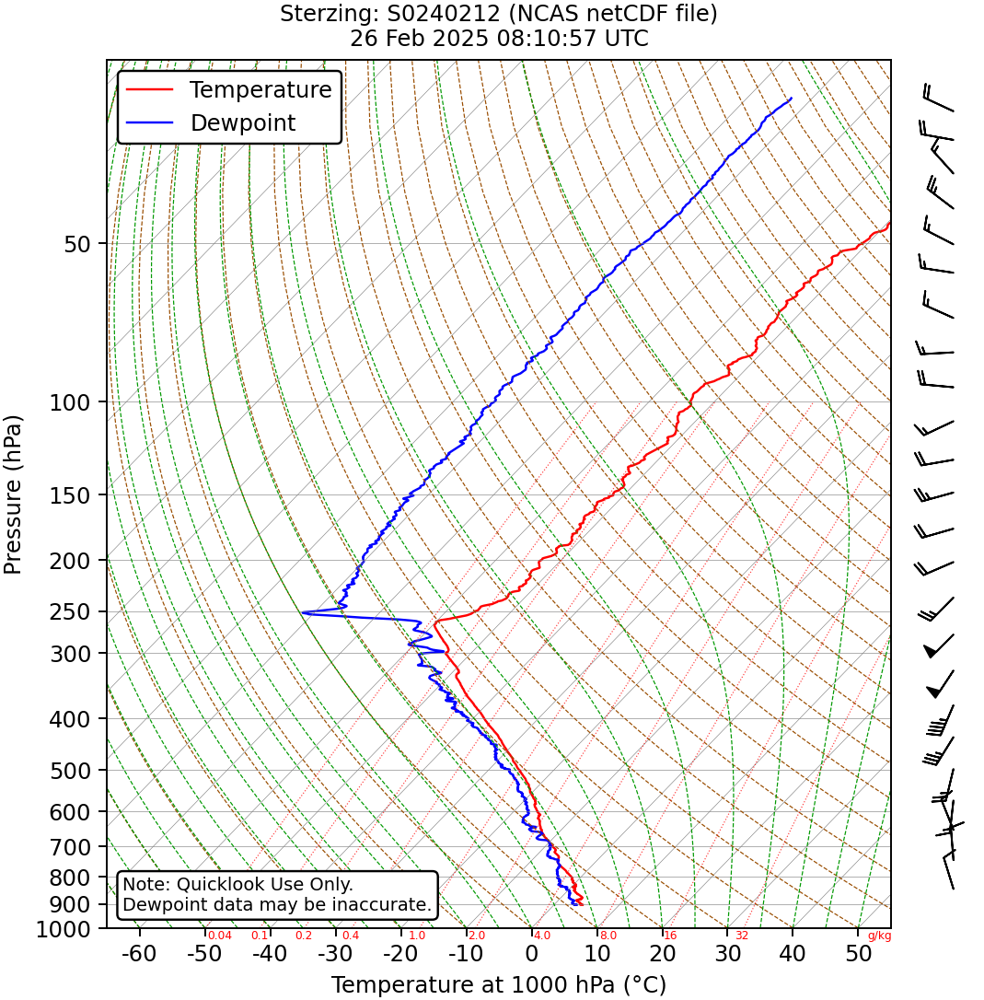
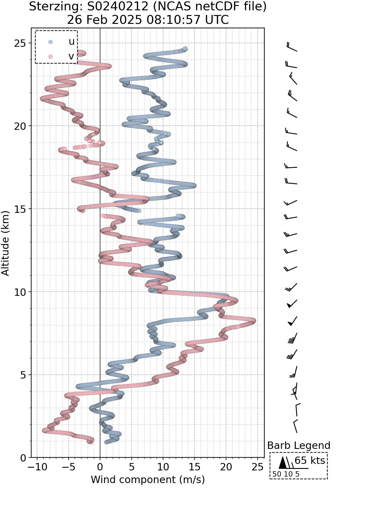
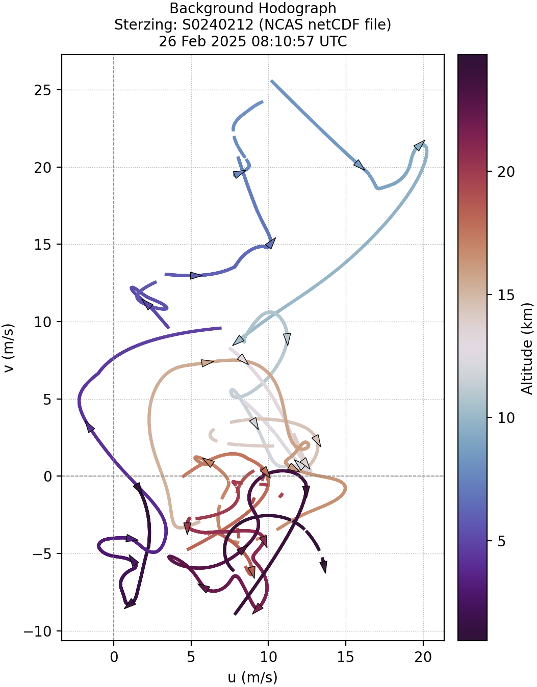
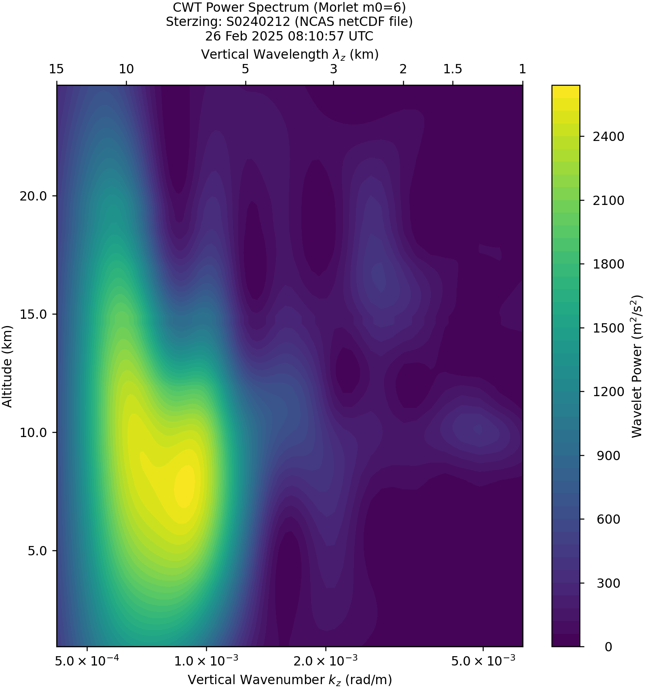

<!--
README revised with assistance from OpenAI's ChatGPT (GPT-5.6 Luna), August 2026.
The repository author remains responsible for the technical accuracy and content.
-->

# TEAMxRadiosondes 🎈

> Tools for reading, processing, and analysing **radiosonde** data from the [TEAMx](https://www.teamx-programme.org/) campaign and related field projects.

---

## 🧭 Overview

**TEAMxRadiosondes** is a Python package and collection of analysis tools for working with radiosonde observations collected during the **TEAMx** campaign and related field projects.

The repository contains tools for processing, visualising, and analysing atmospheric profiles, with a particular focus on high-resolution measurements of temperature, humidity, pressure, and wind. These tools support research into atmospheric processes including **orographic gravity waves and associated momentum transport**.

The package and associated scripts provide functionality to:

* Read and process radiosonde observations from **BUFR** and **NetCDF** files
* Convert and harmonise radiosonde datasets and metadata
* Generate standardised NetCDF files for analysis
* Calculate and work with derived atmospheric quantities
* Produce **Skew-T log-p** diagrams and other diagnostic plots
* Generate vertical profiles and hodographs of wind and thermodynamic variables
* Process radiosonde observations for use in wider TEAMx analysis workflows

The repository is primarily intended for **atmospheric scientists, meteorologists, and researchers** working with radiosonde observations.

---

## 📦 Repository Structure

The repository is organised broadly as follows:

```text
TEAMxRadiosondes_Public/
├── data/
│   └── README.md
├── src/
│   └── TEAMxRadiosondes/
│       ├── __init__.py
│       ├── funcs/
│       ├── RasoThroughModel.py
│       ├── createsondenetcdfs.py
│       ├── generate_radiosonde_bounds.py
│       ├── hodograph.py
│       ├── skewt.py
│       ├── uvprofile.py
│       ├── uvprofiles.py
│       ├── cwtspectra.py
│       └── ...
├── setup.py
├── teamx_environment.yml
├── LICENSE
└── README.md
```

The `src/TEAMxRadiosondes/` directory contains the main analysis and processing scripts, while `data/` contains information and data associated with the radiosonde observations used by the project.

---

## ⚙️ Installation

### Step 1 — Conda environment

A Conda environment file is provided for a reproducible analysis environment.

```bash
git clone https://github.com/tbanyard/TEAMxRadiosondes_Public.git
cd TEAMxRadiosondes_Public

conda env create -f teamx_environment.yml
conda activate teamx
```

### Step 2 — Install the corresponding Python package

The repository also contains a `setup.py` file which can be installed in editable mode:

```bash
cd TEAMxRadiosondes_Public

pip install -e .
```

The editable installation is required to use the analysis tools.

> **Note:** The Conda environment is recommended when reproducing the analysis environment used during development, as some of the processing and plotting scripts rely on a broader set of scientific Python dependencies.

---

## 🧪 Example Usage

### Processing radiosonde data

The repository includes utilities for converting existing radiosonde data into standardised NetCDF files suitable for subsequent analysis.

For example:

```bash
python src/TEAMxRadiosondes/createsondenetcdfs.py \
    -f data/Sterzing/*.nc \
    -l "Sterzing"
```

The exact input format and available options depend on the processing script being used. See the individual scripts for further details.

### Plotting a radiosonde profile

The analysis tools can be used to produce diagnostic figures such as Skew-T log-p diagrams and wind profiles.

For example:

```python
import xarray as xr

from TEAMxRadiosondes import skewt

ds = xr.open_dataset("path/to/sounding.nc")

# See skewt.py for available plotting functions and options.
```

### Running RasoThroughModel.py

`RasoThroughModel.py` provides tools for processing radiosonde observations through the model workflow. The script can be run directly from the command line and provides a number of options for controlling the input data, output, and processing configuration.

To see all available options:

```bash
python src/TEAMxRadiosondes/RasoThroughModel.py --help
```

A typical command can be run as:

```bash
python src/TEAMxRadiosondes/RasoThroughModel.py [options]
```

The available options can be viewed using `--help`. This is recommended before running the script, as some options control the input radiosonde data and processing configuration.

For example:

```bash
python src/TEAMxRadiosondes/RasoThroughModel.py \
    -f path/to/radiosondes*.nc \
    -c path/to/configfile.txt
```

Depending on the analysis being performed, additional options can be supplied to control the processing.

> **Note:** The exact command-line options may change as the analysis workflow develops. The `--help` outputs should therefore be treated as the authoritative reference for the current version of the scripts.


Other tools in the repository provide functionality for:

* Skew-T log-p diagrams
* Hodographs
* Horizontal and vertical wind profiles
* Radiosonde trajectory processing
* Wave and spectral analysis
* Generation of synthetic atmospheric fields
* Conversion of radiosonde data to other formats

---

## 📊 Example Output

The repository is designed to produce a range of diagnostic atmospheric plots, including thermodynamic profiles, wind profiles, hodographs, and other visualisations used in the analysis of radiosonde observations.

<table>
  <tr>
    <td align="center">
      
      <br>
      <strong>Skew-T log-p diagram</strong>
    </td>
    <td align="center">
      
      <br>
      <strong>Wind profile</strong>
    </td>
  </tr>
  <tr>
    <td align="center">
      
      <br>
      <strong>Hodograph</strong>
    </td>
    <td align="center">
      
      <br>
      <strong>Wave spectrum</strong>
    </td>
  </tr>
</table>
---

## 🧩 Dependencies

The project uses the scientific Python ecosystem, including packages such as:

* [NumPy](https://numpy.org/)
* [Pandas](https://pandas.pydata.org/)
* [xarray](https://xarray.dev/)
* [Matplotlib](https://matplotlib.org/)
* [SciPy](https://scipy.org/)
* [pdbufr](https://github.com/ecmwf/pdbufr)
* [ecCodes](https://confluence.ecmwf.int/display/ECC)
* [netCDF4](https://unidata.github.io/netcdf4-python/)

The precise versions used for development are specified in `teamx_environment.yml` and `setup.py`.

For the most reproducible setup, using the supplied Conda environment is recommended.

---

## 📁 Data

The `data/` directory ought to contain the radiosonde data. This can be accessed on request by email from: tpb38@bath.ac.uk

The data have been compiled from multiple sources, including:

* **BUFR** files from Bozen (KIT, Germany)
* **BUFR** files from Kolsass (UIBK, Austria)
* **NetCDF** files from Sterzing (NCAS, UK)

The data should currently be considered **preliminary**. They may contain inconsistencies and have not necessarily undergone comprehensive quality-control checks.

Please consult [`data/README.md`](data/README.md) for further information on:

* Data provenance
* Data versions
* File naming conventions
* Processing history
* Appropriate attribution and onward use

When using these data, please ensure that the relevant contributing organisations and data providers are appropriately acknowledged.

---

## 📝 Data File Naming Convention

Radiosonde files generally follow the naming convention:

```text
YYYYmmDDHHMMSS_SSSSSSSS_LLLLLLLL_IIII_vX.X.ABC
```

where:

| Field            | Description                                   |
| ---------------- | --------------------------------------------- |
| `YYYYmmDDHHMMSS` | Radiosonde launch date and time               |
| `SSSSSSSS`       | Radiosonde serial number                      |
| `LLLLLLLL`       | Launch site                                   |
| `IIII`           | Institution of origin                         |
| `vX.X.ABC`       | Data version and initials of the file creator |

The data currently contain multiple processing versions. See [`data/README.md`](data/README.md) for the current version history.

---

## 🔬 Scientific Context

The radiosonde data and analysis tools in this repository were developed in support of research conducted as part of the **TEAMx** campaign and, in particular, the **TEAMx-FLOW** project.

The data provide high-resolution vertical observations of the atmospheric thermodynamic and kinematic structure. These observations can be used to investigate phenomena including:

* Atmospheric gravity waves
* Orographic wave breaking
* Vertical wind shear
* Momentum transport and deposition
* Thermodynamic structure of the lower and middle atmosphere
* Mountain-wave interactions with the surrounding flow

---

## 🧑‍💻 Development

The repository is under active scientific development and contains both reusable package functionality and research-specific analysis scripts.

For code formatting and static checking, tools such as `black` and `ruff` may be used:

```bash
black src/TEAMxRadiosondes
ruff check src/TEAMxRadiosondes
```

If tests are added to the repository, they can be run with:

```bash
pytest
```

When extending the project, please keep processing scripts, reusable functions, and research-specific analysis clearly separated where practical.

---

## 📚 Citation

If you use the software or analysis tools from this repository in academic work, please cite the repository and the associated TEAMx research where appropriate.

A suggested software citation is:

> Banyard, T. P. (2025). *TEAMxRadiosondes: Radiosonde Processing Toolkit for TEAMx and Related Campaigns*. GitHub repository. https://github.com/tbanyard/TEAMxRadiosondes_Public

Please also acknowledge the organisations and researchers responsible for the underlying radiosonde observations when using the data. Refer to [`data/README.md`](data/README.md) for further information on data provenance and attribution.

---

## 📜 License

This project is licensed under the **MIT License**.

See [`LICENSE`](LICENSE) for the full license text.

